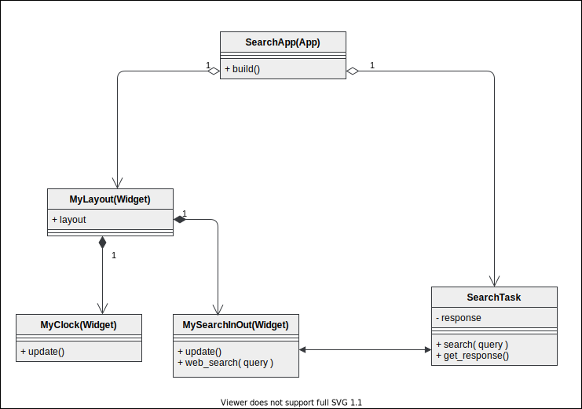

# Web search API

This lesson uses the DuckDuckGo Instant Answer API.  This is a free to use web API that does not require developers to register, but do check their terms and conditions in the guide at <https://duckduckgo.com/api>

Here's a simple example to try in a web browser.

```sh
https://api.duckduckgo.com/?q=DuckDuckGo&format=json
```

## Program overview

The Python program uses the Kivy UI framework.  

This UML class diagram summarizes the structure of the program.  To keep it simple inheritance from the Kivy App and Widget classes is shown in Python notation ```(App)``` or ```(Widget)``` rather than UML notation.

The ```SearchTask``` makes calls to the DuckDuckGo API and passes the responses to the user interface.



## Problems with this program

The program is very simple and the user interface is not elegant, but it does work.

The user interface includes a constantly updated time and date display.  However, as Python programs run in a single thread this is not updated while waiting for the web api to return data.  Most of the time this won't be a problem and users of the program might not notice this.

### Some experiments to try

Try slowing down the search calls.  You can do this by changing the value of ```delay_test_seconds``` in the file ```searchtask.py```

Find out what the default ```timeout``` value is for ```requests.get()```   How would the program behave if the server did not return data and the call had to expire? 

### How can we improve the program?

One solution might be to not use Python. If the program is re-written as a web application using Javascript then we could take advantage of the built-in *concurrency* of the web browser environment. To learn more about this, see <https://developer.mozilla.org/en-US/docs/Web/JavaScript/EventLoop>.

Another possible solution is to ensure our users are warned that there might be delays.  This is quite a simple solution to implement, all it requires is some changes to the user interface.

However, if we choose to stay with Python, then there are several ways to implement concurrency in Python, and one of these is demonstrated in the next lesson.